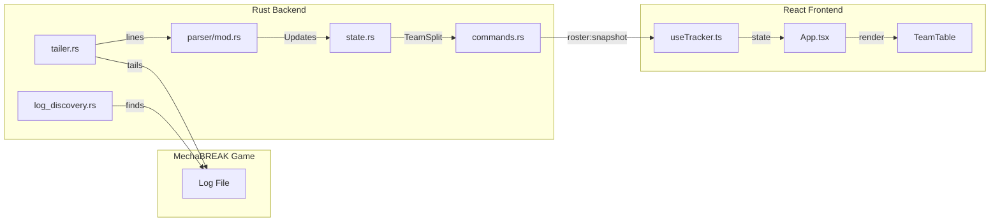

# Mecha Parser - Architecture & Codebase Documentation

## Overview

**Mecha Parser** is a Windows desktop application that provides live roster tracking for the game **MechaBREAK**. It monitors the game's log files in real-time and displays team compositions, player ready states, and mecha selections in a modern UI.

**Tech Stack:**
- **Frontend:** React 19 + TypeScript + Vite + TailwindCSS
- **Backend:** Tauri 2 (Rust) for native OS integration
- **UI Components:** Radix UI (shadcn-style)

---

## Project Structure

```
mecha-parser/
├── src/                    # React frontend
│   ├── App.tsx             # Main app component (Shell, TeamTable, SettingsPanel)
│   ├── main.tsx            # React entry point
│   ├── types.ts            # TypeScript type definitions
│   ├── components/
│   │   ├── About.tsx       # About page component
│   │   └── ui/             # Reusable UI components (tabs, table, button)
│   ├── hooks/
│   │   ├── useTracker.ts   # Hook for tracking status & roster snapshots
│   │   └── useConfig.ts    # Hook for app configuration
│   ├── lib/
│   │   ├── tauri.ts        # Tauri detection helpers
│   │   ├── tracker.ts      # Tauri command wrappers (IPC)
│   │   ├── mechaNames.ts   # Mecha ID to name mapping
│   │   └── utils.ts        # Utility functions (cn)
│   └── styles/             # CSS styles
│
├── src-tauri/              # Rust backend (Tauri)
│   ├── Cargo.toml          # Rust dependencies
│   ├── tauri.conf.json     # Tauri configuration
│   ├── capabilities/       # Tauri v2 capabilities
│   │   └── default.json    # Permission configuration
│   └── src/
│       ├── main.rs         # Application entry point
│       ├── lib.rs          # Library exports
│       ├── commands.rs     # Tauri commands (IPC handlers)
│       ├── config.rs       # Configuration persistence
│       ├── log_discovery.rs # Game log file detection
│       ├── tailer.rs       # File tailing implementation
│       ├── state.rs        # Player state management
│       ├── types.rs        # Rust type definitions
│       └── parser/
│           └── mod.rs      # Log line parsing logic
│
├── Mecha Break Tracker/    # Legacy Python tracker (untracked)
├── package.json            # Node dependencies & scripts
├── README.md               # Basic usage documentation
└── claude.md               # Local development notes
```

---

## Key Components

### Frontend (React)

#### `App.tsx`
The main application with three tabs:
- **Roster Tab:** Displays Team 1, Team 2, and Unassigned players in tables
- **Settings Tab:** Configure log discovery mode (Auto/Manual) and manual log path
- **About Tab:** Application information

**Key Components:**
- `Shell` - Layout wrapper with header and tracking controls (Start/Stop buttons)
- `TeamTable` - Displays player list with columns: Player, Mecha, AI status, Ready status
- `SettingsPanel` - Configuration UI for log source
- `mechaNames.ts` - Maps internal mecha IDs (e.g., 100010) to display names (Skyraider)

#### `types.ts`
Core TypeScript types:
```typescript
type Player = {
  playerId: string;
  displayName?: string;
  ready?: boolean;
  mechaId?: number;
  isAi?: boolean;
  campId?: number;
};

type TeamSplit = { team1: Player[]; team2: Player[]; unassigned: Player[] };
type RosterSnapshot = { version: number; teams: TeamSplit };
type TrackerStatus = { tracking: boolean; logPath?: string; lastError?: string };
type LogMode = "Auto" | "Manual";
type AppConfig = { mode: LogMode; manualLogPath?: string; assetPackDir?: string };
```

#### `useTracker.ts`
React hook that:
- Maintains `status` (TrackerStatus) and `snapshot` (RosterSnapshot) state
- Listens to Tauri events (`roster:snapshot`, `tracker:status`)
- Exposes `startTracking()` and `stopTracking()` functions

---

### Backend (Rust/Tauri)

#### `commands.rs` - Tauri Commands
Exposed to frontend via IPC:

| Command | Description |
|---------|-------------|
| `start_tracking` | Discovers log file and starts background tailer |
| `stop_tracking` | Stops the tailer thread |
| `get_status` | Returns current TrackerStatus |
| `get_config` | Loads/returns AppConfig |
| `set_config` | Saves configuration to app data |

**TrackerController** (managed state):
- Holds tracking state, stop flag, tailer handle, config cache
- Emits events: `roster:snapshot`, `tracker:status`

#### `log_discovery.rs`
Locates the MechaBREAK log file automatically:
1. Scans running processes via `sysinfo`
2. Matches process names: `mechabreak`, `starmechabreak`, `seasungame`
3. Probes candidate paths relative to game executable:
   - `{parent}/logs/MechaBREAK/`
   - `{parent}/MechaBreak/logs/MechaBREAK/`
   - `{parent}/Game/MechaBreak/logs/MechaBREAK/`
4. Selects the newest log file in the newest subfolder

#### `tailer.rs`
File tailing implementation:
- Spawns a background thread that reads new lines from the log file
- Starts at EOF (like `tail -f`)
- Detects file truncation/rotation and re-opens
- Sends lines via `mpsc::channel` to the parser

#### `parser/mod.rs`
Parses log lines into state updates using multiple strategies:

**Regex Patterns:**
- `PLAYER_LINE` - Selection/prepare screen: `playerId:..., displayName:..., mechaId:..., ready:...`
- `READY_NOTICE_LINE` - Ready state changes: `OnEmBattleReadyStateNotice playerId: ... ready: ...`
- `MECHA_SELECT_LINE` - Mecha selection: `playerId:... displayName:... 选择机甲[...]`

**JSON Extraction:**
- Extracts embedded JSON from log lines (handles noisy formatting)
- Parses `EnterWarVoiceRoom` messages for team assignments (`campId`, `campPlayers`)
- Handles mecha selection protocol and ready updates

**Update Types:**
- `ResetPlayers` - Triggered by `GAME_S2C_QUERY_COMBAT_RECORD_RESULT`
- `PlayerUpdate` - Partial update to a player's state

#### `state.rs`
Maintains player state with:
- `IndexMap<String, Player>` - Ordered map keyed by playerId (LRU-style eviction)
- `apply_update()` - Merges partial updates, only marks dirty if changed
- `snapshot_teams()` - Splits players into Team 1/2/Unassigned by `campId`
- Max 50 players, oldest evicted first

#### `types.rs`
Rust type definitions (serde-serializable, camelCase):
- `Player`, `TeamSplit`, `RosterSnapshot`, `TrackerStatus`, `AppConfig`, `LogMode`

---

## Data Flow



1. **Log Discovery:** On `start_tracking`, finds the latest MechaBREAK log file
2. **Tailing:** Background thread reads new lines as they're written
3. **Parsing:** Each line is parsed into 0..N `Update` messages
4. **State Management:** Updates are applied to `PlayersState`
5. **Snapshotting:** Every ~120ms (if dirty), emits `RosterSnapshot` event
6. **UI Update:** React receives snapshot via event listener, re-renders tables

---

## Development

### Prerequisites
- **Node.js** (v18+)
- **Rust** (via rustup, MSVC toolchain on Windows)

### Commands

```bash
# Install dependencies
npm install

# Web preview (no Tauri features)
npm run dev

# Full desktop app with Rust backend
npm run tauri:dev

# Production build
npm run tauri:build
```

### Configuration
Configuration is stored in the app data folder (`C:\Users\<user>\AppData\Roaming\com.ibraved.mechatracker\`):
- **Mode:** `Auto` (process discovery) or `Manual` (user-specified path)
- **Manual Log Path:** Direct path to the log file

---

## Key Dependencies

### Frontend
| Package | Purpose |
|---------|---------|
| `@tauri-apps/api` | Tauri IPC communication |
| `@radix-ui/react-tabs` | Accessible tabs component |
| `lucide-react` | Icons |
| `tailwindcss` | Styling |

### Backend (Rust)
| Crate | Purpose |
|-------|---------|
| `tauri` | Desktop app framework |
| `sysinfo` | Process enumeration for log discovery |
| `regex` | Log line parsing |
| `serde` / `serde_json` | Serialization for IPC |
| `indexmap` | Ordered map for player state |

---

## Notes

- **Windows-only:** Log discovery relies on Windows process paths
- **No bundled assets:** Does not include MechaBREAK game assets
- **Legacy tracker:** The `Mecha Break Tracker/` folder contains an older Python-based tracker (untracked in git)
